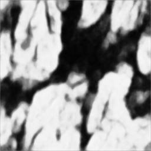
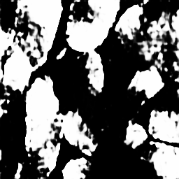
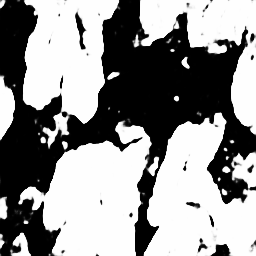
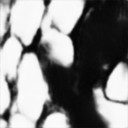
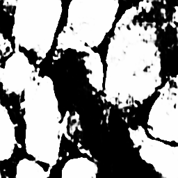
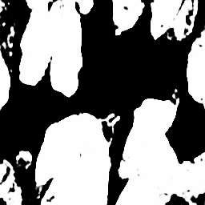
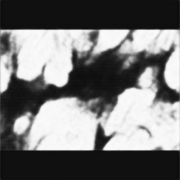
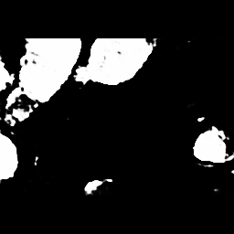
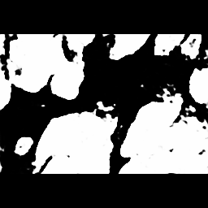

# AIC final project
## Run code
### require packages
```
pip install opencv-python
pip install numpy
pip install tqdm
pip install staintools
pip install spams-bin
pip install torch torchvision torchaudio --index-url https://download.pytorch.org/whl/cu118  --> 呃我不確定這個，可能就裝適合你的CUDA & pytorch
```
### data preparation
去[kaggle](https://www.kaggle.com/datasets/sani84/glasmiccai2015-gland-segmentation) 下載好資料後放到dataset 裡面，像這樣
```
final_project
|__ dataset
|   |__ Grade.csv
|   |__ testA_1.bmp
|   |__ testA_1_anno.bmp
|   |__ testA_2.bmp
|   |__ testA_2_anno.bmp
|   |__ ...
|   |__ train_85.bmp
|   |__ train_85_anno.bmp
|__ prepare_dataset.py
|__ unet.py
```
然後跑`python prepare_dataset.py`，他會把資料整理成images、masks、test、train，變成這樣
```
final_project
|__ dataset
|   |__ Grade.csv
|   |__ images
|   |   |__ test
|   |   |   |__ testA_1.bmp
|   |   |   |__ testA_2.bmp
|   |   |   |__ ...
|   |   |   |__ testB_20.bmp
|   |   |
|   |   |__ train
|   |       |__ train_1.bmp
|   |       |__ train_2.bmp
|   |       |__ ...
|   |       |__ train85.bmp
|   |
|   |__ masks
|       |__ test
|       |   |__ testA_1_anno.bmp
|       |   |__ testA_2_anno.bmp
|       |   |__ ...
|       |   |__ testB_20_anno.bmp
|       |
|       |__ train
|           |__ train_1_anno.bmp
|           |__ train_2_anno.bmp
|           |__ ...
|           |__ train85_anno.bmp
|
|__ prepare_dataset.py
|__ unet.py
```
### train model
```
python unet.py
```
跑完會把模型存到model/unet.pth<br>
輸出圖片會存到results/{image name}_pred.bmp，也可以用`--output_name <your_output_name>` 改成自己想要的名字，image name 是圖片原本的名字(testA_1.bmp, testB_1.bmp ...)
> ex: `--output_name base`，則輸出名稱為`{image name}_base.bmp`

[這裡](https://drive.google.com/drive/folders/1rVyESy9RzuWLcLJSpSTzRsND2tFs0J2E?usp=sharing)可以下載我之前train 好的模型

## results
### 1. base (train 3 min, UNet_0511_base.pth)
預設是把圖片轉成灰階、resize to 256*256，跑30個epoch<br>
dice: 0.8491, IoU: 0.7492, last training loss: 1.7188
```
python unet.py
```
<p align="center">

<-- testA_1, testA_8-->

</p>

### 2. 增加epoch
- epoch = 300 (train 18 min, UNet_0511_ep300.pth)<br>
    跟base 的設定一樣，只是epoch = 300<br>
    ```
    python unet.py --ep 300
    ```
    dice: 0.8645, IoU: 0.7709, last training loss: 0.0675
<p align="center">

<-- testA_1, testA_8-->

</p>

### 3. 用彩色圖片去訓練 + color normalization
base + 用macenko 做color normalization，train_6.bmp 當 target img<br>
```
python unet.py --ep 30 --rgb
python unet.py --ep 300 --rgb
```
- epoch = 30 (train 45 min, UNet_0512_macenko30.pth):<br>
dice: 0.7775, IoU: 0.6571, last training loss: 1.6895 (比gray scale差)
- epoch = 300 (train 7h 45min, UNet_0512_macenko300.pth):<br>
dice: 0.8791, IoU: 0.7927, last training loss: 0.0663<br>
<p align="center">

<-- testA_1 (ep=30) testA_8 -->

</p>
<br>
<p align="center">

<-- testA_1 (ep=300) testA_8-->

</p>

### 4. resize + padding
灰階，把圖片較短的邊resize 到256，另一邊等比例縮小(base 是直接把圖片變成正方形去訓練，這裡保留原本的長寬比)，不夠的地方zero padding，最後整張圖片還是256*256(為了配合UNet 的架構，他好像只能收$2^n$ * $2^n$的圖片?)<br>
```
python unet.py --ep 30 --resize
python unet.py --ep 300 --resize
```
- epoch = 30 (train 2 min, UNet_0514_resize30.pth)<br>
dice: 0.8367, IoU: 0.7343 (比gray scale差)
- epoch = 300 (train 18 min, UNet_0514_resize300.pth)<br>
dice: 0.8531, IoU: 0.7571, last training loss: 0.0600 (好像沒有很好?)<br>
<p align="center">

<-- testA_1 (ep=30) testA_8 -->

</p>
<br>
<p align="center">

<-- testA_1 (ep=300) testA_8-->

</p>

## TODO
- 更多實驗
    > try different ep, lr.<br>
    > different color normalization method: vahadane
    > different color normalization target image (current train_6)
    > how to improve rgb image's prediction result? 為什麼用彩色圖片訓練反而比灰階的訓練結果還要差!?
    > training set & validation set
    > try different UNet architecture?
