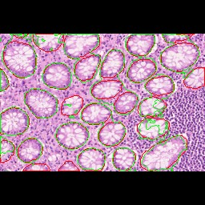
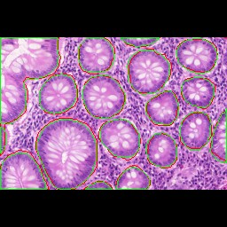
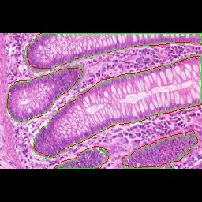
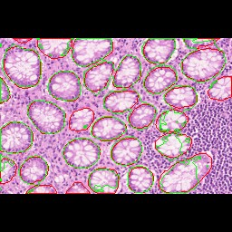
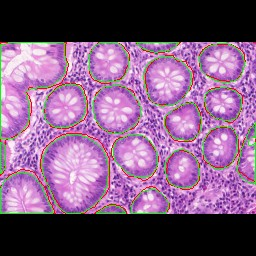

# AIC final project -- Medical Image Analysis: Binary Segmentation of Physiology Images

## Introduction
 

Our project topic is **binary segmentation of physiology images**. We used the GlaS dataset, with 85 training and 80 testing images. And we used UNet and DCAN models, conducted different experiments and used different metrics to measure overlap and boundary quality.

**UNet** is an encoder-decoder neural network architecture. Its encoder acts as a contracting path, extracting context and global features, while the decoder, an expansive path, focuses on precise localization and capturing fine boundary details. The skip connection between the encoder and decoder reuse high-resolution features from encoder to improve localization and segmentation quality. Consequently, UNet has become a highly valuable model in the field of medical image processing, often demonstrating excellent performance even when trained on constrained datasets.

**DCAN** extends UNet with a contour-aware decoder. It adds two expansive paths: one for precise object localization and another for refining boundary details. This dual-decoder setup improves boundary quality and enhances segmentation in applications like medical images.

We use **dice** and **IoU** to evaluate the overlap between ground truth and prediction. **HD** and **ASSD** measure the distance between ground truth and predicted boundaries.

## Run code
### require packages
```
pip install -r requirements.txt
```

### data preparation
Download data from [kaggle](https://www.kaggle.com/datasets/sani84/glasmiccai2015-gland-segmentation) as shown below
```
final_project
|__ dataset
|   |__ Grade.csv
|   |__ testA_1.bmp
|   |__ testA_1_anno.bmp
|   |__ testA_2.bmp
|   |__ testA_2_anno.bmp
|   |__ ...
|   |__ train_85.bmp
|   |__ train_85_anno.bmp
|__ prepare_dataset.py
|__ unet.py
```

And then run `python prepare_dataset.py` to sort the data as shown below
```
final_project
|__ dataset
|   |__ Grade.csv
|   |__ images
|   |   |__ test
|   |   |   |__ testA_1.bmp
|   |   |   |__ testA_2.bmp
|   |   |   |__ ...
|   |   |   |__ testB_20.bmp
|   |   |
|   |   |__ train
|   |       |__ train_1.bmp
|   |       |__ train_2.bmp
|   |       |__ ...
|   |       |__ train85.bmp
|   |
|   |__ masks
|       |__ test
|       |   |__ testA_1_anno.bmp
|       |   |__ testA_2_anno.bmp
|       |   |__ ...
|       |   |__ testB_20_anno.bmp
|       |
|       |__ train
|           |__ train_1_anno.bmp
|           |__ train_2_anno.bmp
|           |__ ...
|           |__ train85_anno.bmp
|
|__ prepare_dataset.py
|__ unet.py
```

### train model
We have two models, UNet (unet.py) and DCAN (DCAN.py). Running these codes will generate a model saved in `model/{model name}.pth` and a text file `result.txt` recording the training loss.

- UNet
    ```
    python unet.py
    ```
- DCAN
    ```
    python DCAN.py
    ```
- args
    | args | usage |
    |---|---|
    |--ep|set the number of training epoch (default is 30 epoch)|
    |--output_name|set the output files name (default is "pred").<br>This will be the name of the saved model and images|
    |--rgb|use rgb image to train (default use gray scale iamges)|
    |--resize|resize and padding to preserve the aspect ratio<br>(default is directly resize to 256*256)|
    |--tta|use TTA (Test-Time Augmentation) while testing|
    |--visualize|draw the prediction result and save as {image name}_{output name}.bmp,<br>image name is the original image name such as testA_36|
    |--test|test the saved model. Usage: --test "{model_name}.pth"|
    |--drawGT|draw the predicted image with ground truth contour|

## Results
### experiments
1. Base: gray scale, directly resize to 256*256, epoch 30
2. Different model: U-Net and DCAN
3. Different number of epochs: 30 vs 300
4. RGB vs. grayscale image
5. Directly resize to 256*256 vs. Resize + padding (in the following results, "resize" means resize + padding)
6. With / Without data augmentation
7. With / Without TTA(Test-Time Augmentation)

### UNet
| setting | Dice | IoU | HD | HD95 | ASSD |
|---|---|---|---|---|---|
|base (ep 30)|0.8439|0.7398|58.6638|17.5872|2.7776|
|base, ep 300|0.8556|0.7599|53.3327|10.5369|1.7509|
|base, ep 300, TTA|0.8776|0.7944|49.4731|9.1324|1.5478|
|resize, ep 30|0.8240|0.7175|44.3854|14.9751|2.5614|
|resize, ep 300|0.8458|0.7449|43.8974|14.1630|2.2574|
|resize, ep 300, TTA|0.8555|0.7672|42.3106|14.3131|2.8516|
|rgb, ep 30|0.8186|0.7110|45.3115|12.1988|2.2212|
|rgb, ep 300|0.8675|0.7782|44.4096|7.5542|1.2965|
|rgb, ep 300, TTA|0.8872|0.8088|40.9608|6.5984|1.1374|
|rgb, resize, aug, ep 30|0.8711|0.7796|41.0408|9.7818|1.3726|
|rgb, resize, aug, ep 300|0.8844|0.8014|39.0133|6.2782|1.0860|
|rgb, resize, aug, ep 300, TTA|**0.8969**|**0.8214**|**33.5581**|**5.2760**|**0.9053**|

### DCAN
| setting | Dice | IoU | HD | HD95 | ASSD |
|---|---|---|---|---|---|
|base (ep 30)|0.8793|0.7943|44.4036|10.4059|1.7353|
|base, ep 300|0.8422|0.7843|51.0730|9.8453|1.8192|
|base, ep 300, TTA|0.8850|0.8056|47.4312|9.0310|1.5612|
|rgb, ep 30|0.8743|0.7868|41.8043|13.7098|2.0924|
|rgb, ep 300|0.8831|0.7989|49.6056|12.3183|1.7844|
|rgb, ep 300, TTA|**0.8971**|**0.8206**|46.3536|8.8439|1.3252|
|rgb, resize, aug, ep 30|0.8786|0.7917|37.3987|11.6201|1.5970|
|rgb, resize, aug, ep 300|0.8772|0.7912|38.2794|6.3488|1.0812|
|rgb, resize, aug, ep 300, TTA|0.8885|0.8092|**36.6038**|**5.9470**|**1.0650**|

For gray and RGB images, gray image slightly outperforms RGB iamge when training with 30 epoch, but after training longer (300 epoch), RGB image helps the model to get a better results.

Pad-resize hurts Grayscale model but enhances RGB model. We think it is because that RGB models can use color gradients to distinguish real edges from padding, and padding keeps the original shape of image. On the other hand, gray scale image only has intensity, so the padding confuses the model and therefore gives a poorer result.

TTA effectively reduces random noise and keep more robust patterns, improving the evaluate metrics for 2% to 4%.

As for different models, for area metrics like Dice, DCAN generally performs better. As for HD95, DCAN is expected to perform better, and it does on grayscale images, but when using RGB, UNet actually outperforms. We guess it’s because additional color may distract DCAN from focusing on precise boundaries.

### result images
The green line is our prediction result, and the red line is the ground truth contour.

**UNet** (rgb, resize, aug, ep 300, TTA)

  

**DCAN** (rgb, resize, aug, ep 300, TTA)

  
